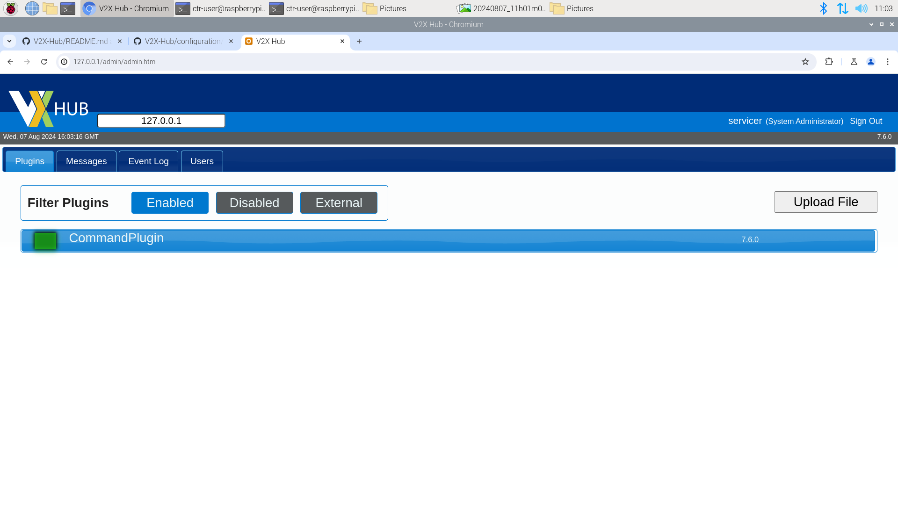
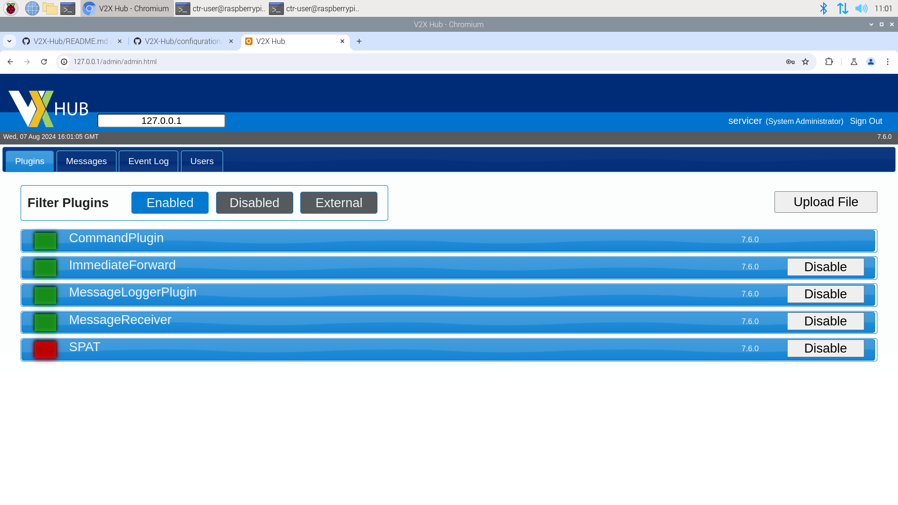

# Receiving SPaT from Industrial RPi

## Purpose
A 'Proof-of-Concept' of cyber-safely retrieving SPaT data and providing it through a serial interface.

The idea is to run V2X Hub on the hardened/industrial Raspberry Pi (RPi) to prove retrieval of SPaT data from the traffic signal controller. We need to rig-up a serial cable and interface it between the RPi and one of the Advantech machines.

## Connection to Advantech
```
ssh servicer@162.191.137.220
```

## Setup V2X Hub
V2X Hub can run on any operating system that supports docker. Follow the steps to successfully install it.

Ensure your system is up to date
```
sudo apt update
sudo apt upgrade
```

Clone the V2XHub source code into your working environment
```
git clone https://github.com/usdot-fhwa-OPS/V2X-Hub.git
```

Once installed, navigate to the configuration directory and stop any mysql instance running on the machine, if any (This will ensure standardization during deployment).
```
cd ./V2X-Hub/configuration

sudo service mysql stop
sudo systemctl stop mysql
```

Run the ```initialization.sh``` script as root
```
chmod +x initialization.sh
sudo ./initialization.sh
```

The shell script will initialize the docker containers, mysql database, and other dependencies needed for the V2X Hub Admin Portal (takes a couple of minutes). Then, you will be prompted to enter a usernames and/or passwords for the V2X Hub Portal and database (note these credentials for later). After it's done, let's check that all the containers are running (You should see the 'php', 'v2xhub', and 'mysql' images running).
```
sudo docker ps
```

Once the images are ready, this means that V2X Hub was installed successfully!

## Using V2X Hub

Open your browser to the address below. The browser will show a "Warning: Potential Security Risk" message, but since we know V2X Hub is safe, we can accept the SSL certificate (depending on browser, click "Advanced", then "Accept Risk"). After accepting the risk, the page will do nothing. Proceed to next step.
```
https://127.0.0.1:19760/
```

Next, navigate to the V2X Hub Web UI and enter the credentials from the 'initialization.sh'. This will give you access to the V2X Interface.
```
http://127.0.0.1/
```

The first tab shown is 'Plugins', which will show you a list of enabled plugins.


By default, there will only be one plugin enabled ('CommandPlugin'). Click on 'Disabled' in the 'Filter Plugins' and enable ```ImmediateForward```, ```MessageLoggerPlugin```, ```MessageReceiver```, and ```SPAT``` (These are the plugins we will be using). Then click 'Disabled' again under 'Filter Plugins'. You should see all the enabled plugins and will appear here every time you access V2X.


